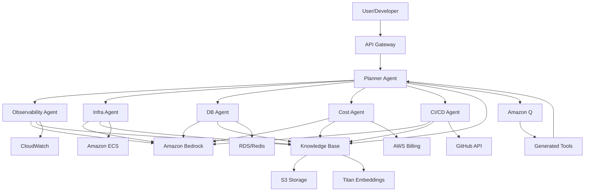
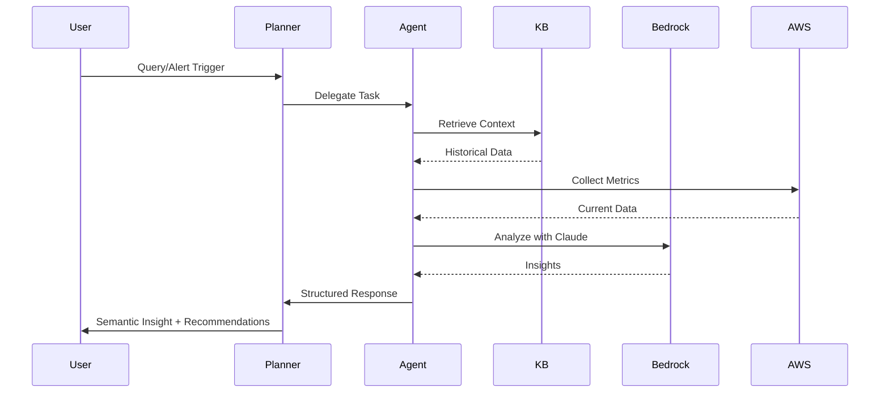

# Design Document: AutoPilotAI

## Overview

AutoPilotAI is a multi-agent AI SRE system built on Amazon Bedrock that provides intelligent infrastructure monitoring, cost optimization, and predictive analysis for Indian startups. The system employs six specialized agents coordinated by a Planner Agent, leveraging Claude Sonnet for root-cause analysis and Amazon Q for dynamic tool generation.

The key innovation is semantic insight generation - transforming raw metrics like "CPU: 78%" into actionable recommendations like "Your Celery worker pool is mis-sized relative to Redis throughput causing job starvation. Recommend worker pool = 12. Projected cost reduction = ₹18,300/month."

The system implements agentic recursion, where AI agents use Amazon Q to generate tools (infrastructure scanners, deployment pipelines, migration scripts) that the system then uses for monitoring and optimization.

## Architecture

### High-Level Architecture



### Agent Architecture

Each specialized agent follows a common pattern:
1. **Input Processing**: Receives task from Planner Agent with context
2. **Context Retrieval**: Queries Knowledge Base for relevant historical data
3. **Analysis**: Uses Claude Sonnet via Bedrock for reasoning
4. **Tool Invocation**: Calls AWS APIs or generated tools for data collection
5. **Insight Generation**: Produces semantic insights with business impact
6. **Response**: Returns structured findings to Planner Agent

### Data Flow



## Components and Interfaces

### 1. Planner Agent

**Responsibility**: Orchestrates multi-agent workflows and coordinates tool usage.

**Interface**:
```python
class PlannerAgent:
    def process_query(self, query: str, context: Dict) -> Response:
        """
        Processes user query and coordinates agent execution.
        
        Args:
            query: User query or alert trigger
            context: Additional context (user_id, infrastructure_id, etc.)
            
        Returns:
            Response with insights and recommendations
        """
        pass
    
    def delegate_task(self, task: Task, agents: List[AgentType]) -> List[AgentResponse]:
        """
        Delegates tasks to specialized agents.
        
        Args:
            task: Task specification
            agents: List of agent types to invoke
            
        Returns:
            List of responses from agents
        """
        pass
    
    def synthesize_responses(self, responses: List[AgentResponse]) -> Response:
        """
        Synthesizes responses from multiple agents into coherent insight.
        
        Args:
            responses: List of agent responses
            
        Returns:
            Unified response with recommendations
        """
        pass
```

### 2. Observability Agent

**Responsibility**: Metric interpretation, anomaly detection, and bottleneck attribution.

**Interface**:
```python
class ObservabilityAgent:
    def analyze_metrics(self, metrics: MetricData, timerange: TimeRange) -> Insights:
        """
        Analyzes CloudWatch metrics and generates semantic insights.
        
        Args:
            metrics: Metric data from CloudWatch
            timerange: Time range for analysis
            
        Returns:
            Semantic insights with anomaly detection
        """
        pass
    
    def detect_anomalies(self, metric_series: TimeSeries) -> List[Anomaly]:
        """
        Detects anomalies in metric time series.
        
        Args:
            metric_series: Time series data
            
        Returns:
            List of detected anomalies with severity
        """
        pass
    
    def attribute_bottleneck(self, issue: Issue) -> Attribution:
        """
        Attributes performance issues to specific components.
        
        Args:
            issue: Detected performance issue
            
        Returns:
            Attribution with root cause analysis
        """
        pass
```

### 3. Infrastructure Agent

**Responsibility**: Docker/ECS configuration analysis and infrastructure drift detection.

**Interface**:
```python
class InfraAgent:
    def analyze_dockerfile(self, dockerfile: str, history: BuildHistory) -> OptimizationReport:
        """
        Analyzes Dockerfile for optimization opportunities.
        
        Args:
            dockerfile: Dockerfile content
            history: Historical build data
            
        Returns:
            Optimization recommendations
        """
        pass
    
    def detect_drift(self, current_config: Config, baseline: Config) -> DriftReport:
        """
        Detects infrastructure drift from baseline.
        
        Args:
            current_config: Current infrastructure configuration
            baseline: Baseline configuration
            
        Returns:
            Drift report with impacted resources
        """
        pass
    
    def analyze_worker_sizing(self, worker_config: WorkerConfig, 
                             throughput_data: ThroughputData) -> SizingRecommendation:
        """
        Analyzes worker pool sizing relative to throughput.
        
        Args:
            worker_config: Current worker configuration
            throughput_data: Redis/queue throughput data
            
        Returns:
            Sizing recommendations with cost impact
        """
        pass
```

### 4. Database Agent

**Responsibility**: Query plan analysis, index recommendations, and Redis optimization.

**Interface**:
```python
class DBAgent:
    def analyze_query_plan(self, explain_output: str, query: str) -> QueryAnalysis:
        """
        Analyzes PostgreSQL EXPLAIN ANALYZE output.
        
        Args:
            explain_output: EXPLAIN ANALYZE output
            query: SQL query
            
        Returns:
            Analysis with index recommendations
        """
        pass
    
    def recommend_indices(self, query_patterns: List[QueryPattern]) -> List[IndexRecommendation]:
        """
        Recommends indices based on query patterns.
        
        Args:
            query_patterns: Historical query patterns
            
        Returns:
            Index recommendations with DDL statements
        """
        pass
    
    def analyze_redis_stats(self, info_output: str) -> RedisAnalysis:
        """
        Analyzes Redis INFO statistics.
        
        Args:
            info_output: Redis INFO command output
            
        Returns:
            Analysis with eviction policy recommendations
        """
        pass
```

### 5. Cost Agent

**Responsibility**: Infrastructure cost analysis and optimization recommendations.

**Interface**:
```python
class CostAgent:
    def calculate_cost_impact(self, change: InfraChange) -> CostImpact:
        """
        Calculates cost impact of infrastructure changes.
        
        Args:
            change: Proposed infrastructure change
            
        Returns:
            Cost impact in INR with monthly projections
        """
        pass
    
    def identify_optimization_opportunities(self, 
                                           utilization: ResourceUtilization,
                                           billing: BillingData) -> List[CostOptimization]:
        """
        Identifies cost optimization opportunities.
        
        Args:
            utilization: Resource utilization data
            billing: AWS billing data
            
        Returns:
            List of optimization opportunities ranked by savings
        """
        pass
    
    def analyze_cost_performance_tradeoff(self, 
                                         options: List[InfraOption]) -> TradeoffAnalysis:
        """
        Analyzes cost-performance tradeoffs.
        
        Args:
            options: List of infrastructure options
            
        Returns:
            Tradeoff analysis with recommendations
        """
        pass
```

### 6. CI/CD Agent

**Responsibility**: Build-time regression detection and CI/CD failure prediction.

**Interface**:
```python
class CICDAgent:
    def track_build_times(self, workflow_runs: List[WorkflowRun]) -> BuildTrends:
        """
        Tracks build time trends across commits.
        
        Args:
            workflow_runs: GitHub Actions workflow runs
            
        Returns:
            Build time trends with regression detection
        """
        pass
    
    def detect_regression(self, current_build: BuildData, 
                         baseline: BuildBaseline) -> RegressionReport:
        """
        Detects build-time regressions.
        
        Args:
            current_build: Current build data
            baseline: Baseline build metrics
            
        Returns:
            Regression report with attributed changes
        """
        pass
    
    def predict_failures(self, workflow_history: WorkflowHistory) -> FailurePrediction:
        """
        Predicts CI/CD failures based on patterns.
        
        Args:
            workflow_history: Historical workflow data
            
        Returns:
            Failure predictions with confidence scores
        """
        pass
```

### 7. Knowledge Base

**Responsibility**: RAG system for infrastructure context and historical data.

**Interface**:
```python
class KnowledgeBase:
    def store_configuration(self, config: Configuration, metadata: Dict) -> str:
        """
        Stores infrastructure configuration.
        
        Args:
            config: Configuration data
            metadata: Metadata (timestamp, source, etc.)
            
        Returns:
            Storage ID
        """
        pass
    
    def query_context(self, query: str, filters: Dict) -> List[Document]:
        """
        Queries knowledge base for relevant context.
        
        Args:
            query: Natural language query
            filters: Filters (time range, config type, etc.)
            
        Returns:
            Relevant documents with similarity scores
        """
        pass
    
    def index_metrics(self, metrics: MetricData) -> None:
        """
        Indexes metrics for historical analysis.
        
        Args:
            metrics: Metric data to index
        """
        pass
```

### 8. Tool Generator (Amazon Q Integration)

**Responsibility**: Dynamic tool generation using Amazon Q.

**Interface**:
```python
class ToolGenerator:
    def generate_scanner(self, requirements: ScannerRequirements) -> Tool:
        """
        Generates infrastructure scanning tool.
        
        Args:
            requirements: Scanner requirements specification
            
        Returns:
            Executable tool
        """
        pass
    
    def generate_deployment_pipeline(self, config: DeploymentConfig) -> Pipeline:
        """
        Generates ECS deployment pipeline.
        
        Args:
            config: Deployment configuration
            
        Returns:
            Deployment pipeline definition
        """
        pass
    
    def generate_migration_script(self, migration: MigrationSpec) -> Script:
        """
        Generates database migration script.
        
        Args:
            migration: Migration specification
            
        Returns:
            Executable migration script
        """
        pass
```

## Data Models

### Core Data Structures

```python
@dataclass
class MetricData:
    """CloudWatch metric data"""
    namespace: str
    metric_name: str
    dimensions: Dict[str, str]
    values: List[float]
    timestamps: List[datetime]
    unit: str

@dataclass
class Anomaly:
    """Detected anomaly"""
    metric: str
    timestamp: datetime
    severity: Severity  # CRITICAL, HIGH, MEDIUM, LOW
    expected_value: float
    actual_value: float
    confidence: float
    attribution: Optional[str]

@dataclass
class Insight:
    """Semantic insight"""
    title: str
    description: str
    business_impact: str
    recommendations: List[Recommendation]
    cost_impact: Optional[CostImpact]
    urgency: Urgency  # IMMEDIATE, HIGH, MEDIUM, LOW

@dataclass
class Recommendation:
    """Actionable recommendation"""
    action: str
    rationale: str
    implementation_steps: List[str]
    estimated_effort: str
    expected_benefit: str
    cost_impact: Optional[CostImpact]

@dataclass
class CostImpact:
    """Cost impact analysis"""
    monthly_change_inr: float
    annual_projection_inr: float
    affected_resources: List[str]
    confidence: float

@dataclass
class Configuration:
    """Infrastructure configuration"""
    config_type: ConfigType  # DOCKERFILE, TERRAFORM, ECS_TASK, etc.
    content: str
    source: str  # GitHub repo, S3 path, etc.
    timestamp: datetime
    metadata: Dict[str, Any]

@dataclass
class BuildData:
    """CI/CD build data"""
    workflow_name: str
    run_id: str
    commit_sha: str
    duration_seconds: float
    status: BuildStatus
    timestamp: datetime
    logs: Optional[str]

@dataclass
class QueryPattern:
    """Database query pattern"""
    query_template: str
    execution_count: int
    avg_duration_ms: float
    tables_accessed: List[str]
    indices_used: List[str]
```

### Agent Communication Protocol

```python
@dataclass
class Task:
    """Task for agent execution"""
    task_id: str
    task_type: TaskType
    parameters: Dict[str, Any]
    priority: Priority
    deadline: Optional[datetime]

@dataclass
class AgentResponse:
    """Response from specialized agent"""
    agent_type: AgentType
    task_id: str
    status: ResponseStatus  # SUCCESS, PARTIAL, FAILED
    insights: List[Insight]
    data: Dict[str, Any]
    execution_time_ms: float
```

## Correctness Properties

*A property is a characteristic or behavior that should hold true across all valid executions of a system—essentially, a formal statement about what the system should do. Properties serve as the bridge between human-readable specifications and machine-verifiable correctness guarantees.*


### Property Reflection

After analyzing all acceptance criteria, I've identified several areas where properties can be consolidated:

**Agent Input Handling Consolidation:**
- Properties 2.4, 3.4, 4.4, 5.4, 6.4 all test that agents accept different input types
- These can be consolidated into a single property about agent input polymorphism

**Round-Trip Storage Consolidation:**
- Properties 7.1, 7.2, 7.5 all test storage and retrieval of different data types
- These can be consolidated into a single round-trip property for the Knowledge Base

**Recommendation Format Consolidation:**
- Properties 3.5, 4.2, 5.5, 8.3, 10.2 all test that recommendations include specific required fields
- These can be consolidated into a single property about recommendation completeness

**Attribution Consolidation:**
- Properties 2.3, 4.3, 6.3, 10.5, 12.4 all test that issues include attribution information
- These can be consolidated into a single property about issue attribution

**Tool Generation Consolidation:**
- Properties 9.1, 9.2, 9.3, 9.4, 9.5 all test that Amazon Q generates valid artifacts
- These can be consolidated into fewer properties grouped by artifact type

After consolidation, we have approximately 35 unique properties instead of 60, eliminating logical redundancy while maintaining comprehensive coverage.

### Correctness Properties

Property 1: Agent Routing Correctness
*For any* user query, the Planner Agent should route the query to at least one appropriate specialized agent based on query content and intent.
**Validates: Requirements 1.1, 1.2**

Property 2: Agent Orchestration Ordering
*For any* multi-agent task requiring multiple specialized agents, the Planner Agent should execute agents in a valid dependency order where agents requiring outputs from other agents execute after their dependencies.
**Validates: Requirements 1.4**

Property 3: System Agent Completeness
*For any* system instance, the system should maintain exactly six agents: Observability_Agent, Infra_Agent, DB_Agent, Cost_Agent, CICD_Agent, and Planner_Agent, all in operational state.
**Validates: Requirements 1.3**

Property 4: Semantic Insight Generation
*For any* metric data ingested by the Observability Agent, the generated insights should include business context, severity level, and at least one actionable recommendation.
**Validates: Requirements 2.1, 8.3**

Property 5: Anomaly Detection Sensitivity
*For any* metric time series containing injected anomalies with deviation > 2 standard deviations from baseline, the Observability Agent should detect and report the anomaly with confidence > 0.7.
**Validates: Requirements 2.2**

Property 6: Agent Input Polymorphism
*For any* agent and any valid input type for that agent (CloudWatch metrics, logs, configs, etc.), the agent should successfully process the input and return a structured response without errors.
**Validates: Requirements 2.4, 3.4, 4.4, 5.4, 6.4**

Property 7: Dockerfile Optimization Analysis
*For any* Dockerfile analyzed by the Infra Agent, the analysis report should include at least one optimization category (layer caching, base image, multi-stage builds, or dependency management).
**Validates: Requirements 3.1**

Property 8: Infrastructure Drift Detection
*For any* current configuration that differs from baseline configuration in at least one parameter, the Infra Agent should detect and report the drift with affected resource identification.
**Validates: Requirements 3.2**

Property 9: Configuration Impact Assessment
*For any* infrastructure configuration change, the Infra Agent should produce an impact assessment including resource utilization predictions and affected components.
**Validates: Requirements 3.3**

Property 10: Worker Sizing Recommendations
*For any* worker configuration analysis, if throughput data indicates saturation or under-utilization, the Infra Agent should recommend specific concurrency values with rationale.
**Validates: Requirements 3.5**

Property 11: Index Opportunity Identification
*For any* PostgreSQL query plan with sequential scans on tables > 1000 rows, the DB Agent should identify the missing index opportunity and recommend specific columns for indexing.
**Validates: Requirements 4.1**

Property 12: Index Recommendation Completeness
*For any* index recommendation generated by the DB Agent, the recommendation should include valid SQL DDL statement, target table and columns, and estimated performance impact percentage.
**Validates: Requirements 4.2**

Property 13: Redis Eviction Policy Analysis
*For any* Redis INFO output showing memory pressure (used_memory > 80% of maxmemory), the DB Agent should recommend eviction policy adjustments with expected behavior changes.
**Validates: Requirements 4.5**

Property 14: Cost Impact Calculation
*For any* infrastructure change proposal, the Cost Agent should calculate projected cost impact in INR with monthly and annual projections.
**Validates: Requirements 5.1, 5.5**

Property 15: Cost-Performance Tradeoff Analysis
*For any* optimization scenario with multiple implementation options, the Cost Agent should provide tradeoff analysis ranking options by cost-benefit ratio.
**Validates: Requirements 5.2, 8.5**

Property 16: Right-Sizing Recommendations
*For any* resource with utilization < 30% over 7 days, the Cost Agent should recommend right-sizing with projected monthly savings in INR.
**Validates: Requirements 5.3**

Property 17: Build Time Regression Detection
*For any* Docker build with duration > 1.5x baseline average, the CICD Agent should generate a regression alert with severity proportional to the deviation.
**Validates: Requirements 6.1**

Property 18: Build Trend Tracking
*For any* sequence of GitHub workflow runs, the CICD Agent should maintain historical build time data enabling trend analysis over at least 30 days.
**Validates: Requirements 6.2**

Property 19: Failure Prediction Generation
*For any* workflow with historical failure rate > 10%, the CICD Agent should generate failure predictions with confidence scores based on pattern analysis.
**Validates: Requirements 6.5**

Property 20: Knowledge Base Round-Trip Consistency
*For any* configuration document (Terraform, Dockerfile, GitHub Actions YAML, EXPLAIN output, Redis INFO, billing CSV) stored in the Knowledge Base, retrieving by storage ID should return an equivalent document.
**Validates: Requirements 7.1, 7.2, 7.5**

Property 21: Context Retrieval Relevance
*For any* agent query to the Knowledge Base, all returned documents should have similarity scores > 0.6, ensuring relevance to the query context.
**Validates: Requirements 7.3**

Property 22: Saturation Prediction Generation
*For any* infrastructure change that increases resource utilization, the system should predict future saturation events with time-to-saturation estimates when utilization trajectory exceeds 80%.
**Validates: Requirements 8.1, 8.2**

Property 23: Recommendation Completeness
*For any* recommendation generated by any agent, the recommendation should include action description, rationale, implementation steps, and expected benefit.
**Validates: Requirements 3.5, 4.2, 5.5, 8.3, 10.2**

Property 24: Infrastructure Scanning Tool Generation
*For any* tool generation request to Amazon Q for infrastructure scanning, the generated tool should be executable code with valid syntax and include error handling.
**Validates: Requirements 9.1**

Property 25: Deployment Pipeline Generation
*For any* ECS deployment pipeline generation request, the generated pipeline should include valid ECS task definition JSON and deployment configuration.
**Validates: Requirements 9.2**

Property 26: IAM Policy Generation Validity
*For any* IAM policy generated by Amazon Q, the policy document should be valid JSON conforming to AWS IAM policy grammar with Version, Statement, Effect, Action, and Resource fields.
**Validates: Requirements 9.3**

Property 27: Migration Script SQL Validity
*For any* SQL migration script generated by Amazon Q, the script should contain valid SQL DDL statements (CREATE INDEX, ALTER TABLE, etc.) with proper syntax.
**Validates: Requirements 9.5**

Property 28: Alert Generation Latency
*For any* critical issue detection (severity = CRITICAL), the system should generate and deliver an alert within 60 seconds of detection.
**Validates: Requirements 10.1**

Property 29: Predictive Alert Timing
*For any* resource saturation prediction alert, the time-to-saturation value should be positive, ensuring alerts are generated before saturation occurs.
**Validates: Requirements 10.3**

Property 30: Alert Cost Impact Inclusion
*For any* alert generated by the system, if the issue has cost implications, the alert should include projected cost impact in INR.
**Validates: Requirements 10.4**

Property 31: Issue Attribution Completeness
*For any* infrastructure issue correlated with configuration changes or commits, the issue report should include specific attribution (commit SHA, config file, timestamp).
**Validates: Requirements 2.3, 4.3, 6.3, 10.5, 12.4**

Property 32: Commit Diff Analysis
*For any* commit containing changes to infrastructure files (Dockerfile, Terraform, ECS task definitions, GitHub Actions YAML), the system should analyze the diff and identify infrastructure-impacting changes.
**Validates: Requirements 12.1, 12.3**

Property 33: Workflow Execution Tracking
*For any* GitHub Actions workflow run, the system should store execution data including workflow name, run ID, commit SHA, duration, and timestamp.
**Validates: Requirements 12.2**

Property 34: Workflow Optimization Analysis
*For any* GitHub Actions YAML file analyzed, the system should identify at least one optimization category (caching, parallelization, job dependencies, or resource allocation).
**Validates: Requirements 12.5**

Property 35: Agent Response Structure Consistency
*For any* agent response returned to the Planner Agent, the response should include agent type, task ID, status, execution time, and structured data payload.
**Validates: Cross-cutting requirement for agent communication protocol**

## Error Handling

### Error Categories

1. **Data Collection Errors**
   - AWS API throttling or timeouts
   - Missing CloudWatch metrics
   - GitHub API rate limits
   - Database connection failures

2. **Analysis Errors**
   - Bedrock model invocation failures
   - Malformed configuration files
   - Invalid query plans
   - Insufficient historical data

3. **Tool Generation Errors**
   - Amazon Q generation failures
   - Invalid generated code
   - Tool execution failures

4. **Agent Coordination Errors**
   - Agent timeout
   - Agent unavailability
   - Circular dependencies in multi-agent tasks

### Error Handling Strategies

**Graceful Degradation:**
```python
def analyze_with_fallback(self, data: Any) -> Analysis:
    """
    Attempts analysis with primary method, falls back to simpler heuristics.
    """
    try:
        return self.bedrock_analysis(data)
    except BedrockError as e:
        logger.warning(f"Bedrock analysis failed: {e}, using heuristic fallback")
        return self.heuristic_analysis(data)
    except Exception as e:
        logger.error(f"Analysis failed: {e}")
        return Analysis(status="FAILED", error=str(e))
```

**Retry with Exponential Backoff:**
```python
@retry(
    stop=stop_after_attempt(3),
    wait=wait_exponential(multiplier=1, min=2, max=10),
    retry=retry_if_exception_type(ThrottlingException)
)
def fetch_cloudwatch_metrics(self, namespace: str, metric: str) -> MetricData:
    """
    Fetches CloudWatch metrics with automatic retry on throttling.
    """
    return self.cloudwatch_client.get_metric_data(...)
```

**Partial Results:**
```python
def multi_agent_analysis(self, task: Task) -> Response:
    """
    Returns partial results if some agents fail.
    """
    results = []
    errors = []
    
    for agent in self.required_agents:
        try:
            result = agent.execute(task)
            results.append(result)
        except AgentError as e:
            errors.append((agent.name, str(e)))
            logger.error(f"Agent {agent.name} failed: {e}")
    
    return Response(
        status="PARTIAL" if errors else "SUCCESS",
        results=results,
        errors=errors
    )
```

**Circuit Breaker Pattern:**
```python
class CircuitBreaker:
    """
    Prevents cascading failures by temporarily disabling failing services.
    """
    def __init__(self, failure_threshold: int = 5, timeout: int = 60):
        self.failure_count = 0
        self.failure_threshold = failure_threshold
        self.timeout = timeout
        self.last_failure_time = None
        self.state = "CLOSED"  # CLOSED, OPEN, HALF_OPEN
    
    def call(self, func: Callable) -> Any:
        if self.state == "OPEN":
            if time.time() - self.last_failure_time > self.timeout:
                self.state = "HALF_OPEN"
            else:
                raise CircuitBreakerOpen("Service temporarily unavailable")
        
        try:
            result = func()
            if self.state == "HALF_OPEN":
                self.state = "CLOSED"
                self.failure_count = 0
            return result
        except Exception as e:
            self.failure_count += 1
            self.last_failure_time = time.time()
            if self.failure_count >= self.failure_threshold:
                self.state = "OPEN"
            raise
```

### Error Response Format

All errors should be returned in a consistent format:

```python
@dataclass
class ErrorResponse:
    """Standardized error response"""
    error_code: str  # e.g., "AWS_API_THROTTLE", "BEDROCK_TIMEOUT"
    error_message: str
    component: str  # Which agent/component failed
    timestamp: datetime
    retry_after: Optional[int]  # Seconds until retry recommended
    fallback_available: bool
    context: Dict[str, Any]  # Additional error context
```

## Testing Strategy

### Dual Testing Approach

AutoPilotAI requires both unit tests and property-based tests for comprehensive coverage:

**Unit Tests** focus on:
- Specific examples of metric interpretation
- Edge cases (empty metrics, malformed configs)
- Integration points between agents and AWS services
- Error conditions and fallback behavior
- Specific alert scenarios (Redis fragmentation, build regression)

**Property-Based Tests** focus on:
- Universal properties across all inputs (see Correctness Properties section)
- Agent behavior consistency across random metric data
- Configuration parsing robustness across generated configs
- Cost calculation accuracy across random infrastructure changes
- Recommendation completeness across all agent types

### Property-Based Testing Configuration

**Framework Selection:**
- **Python**: Use Hypothesis for property-based testing
- **TypeScript**: Use fast-check for property-based testing

**Test Configuration:**
- Minimum 100 iterations per property test
- Each test tagged with feature name and property number
- Tag format: `# Feature: autopilot-ai, Property N: [property text]`

**Example Property Test Structure:**

```python
from hypothesis import given, strategies as st
import pytest

@given(
    metrics=st.lists(
        st.builds(
            MetricData,
            namespace=st.text(min_size=1),
            metric_name=st.text(min_size=1),
            values=st.lists(st.floats(min_value=0, max_value=100), min_size=1),
            timestamps=st.lists(st.datetimes(), min_size=1)
        ),
        min_size=1
    )
)
@pytest.mark.property_test
def test_semantic_insight_generation(metrics):
    """
    Feature: autopilot-ai, Property 4: Semantic Insight Generation
    
    For any metric data ingested by the Observability Agent,
    the generated insights should include business context,
    severity level, and at least one actionable recommendation.
    """
    agent = ObservabilityAgent()
    insights = agent.analyze_metrics(metrics, TimeRange.last_hour())
    
    for insight in insights:
        assert insight.business_impact is not None
        assert insight.business_impact != ""
        assert insight.severity in [Severity.CRITICAL, Severity.HIGH, 
                                   Severity.MEDIUM, Severity.LOW]
        assert len(insight.recommendations) >= 1
        assert all(rec.action for rec in insight.recommendations)
```

**Example Unit Test Structure:**

```python
def test_redis_fragmentation_alert():
    """
    Unit test for specific Redis memory fragmentation scenario.
    Tests edge case from Requirement 2.5.
    """
    agent = ObservabilityAgent()
    
    # Simulate Redis metrics with high fragmentation
    metrics = MetricData(
        namespace="Redis",
        metric_name="mem_fragmentation_ratio",
        values=[2.5, 2.7, 2.9],  # High fragmentation
        timestamps=[now(), now() + 60, now() + 120],
        unit="ratio"
    )
    
    insights = agent.analyze_metrics([metrics], TimeRange.last_hour())
    
    # Should generate alert with root cause
    alerts = [i for i in insights if i.severity == Severity.HIGH]
    assert len(alerts) >= 1
    assert "fragmentation" in alerts[0].description.lower()
    assert alerts[0].recommendations[0].action.startswith("Restart Redis")
```

### Integration Testing

**AWS Service Integration:**
- Mock AWS services using moto for unit tests
- Use actual AWS services in integration tests with test accounts
- Test IAM permission boundaries and least-privilege access

**Multi-Agent Integration:**
- Test agent coordination through Planner Agent
- Verify agent response aggregation and synthesis
- Test timeout and failure handling in multi-agent scenarios

**End-to-End Scenarios:**
- Simulate complete user journeys (commit → analysis → alert → recommendation)
- Test the demo scenario: Celery concurrency change detection
- Verify Knowledge Base RAG retrieval in context of agent queries

### Test Coverage Goals

- Unit test coverage: > 80% for core logic
- Property test coverage: All 35 correctness properties implemented
- Integration test coverage: All AWS service integrations
- End-to-end test coverage: Top 5 user scenarios

### Continuous Testing

- Run unit tests on every commit
- Run property tests (100 iterations) on every PR
- Run integration tests nightly against test AWS account
- Run extended property tests (1000 iterations) weekly
